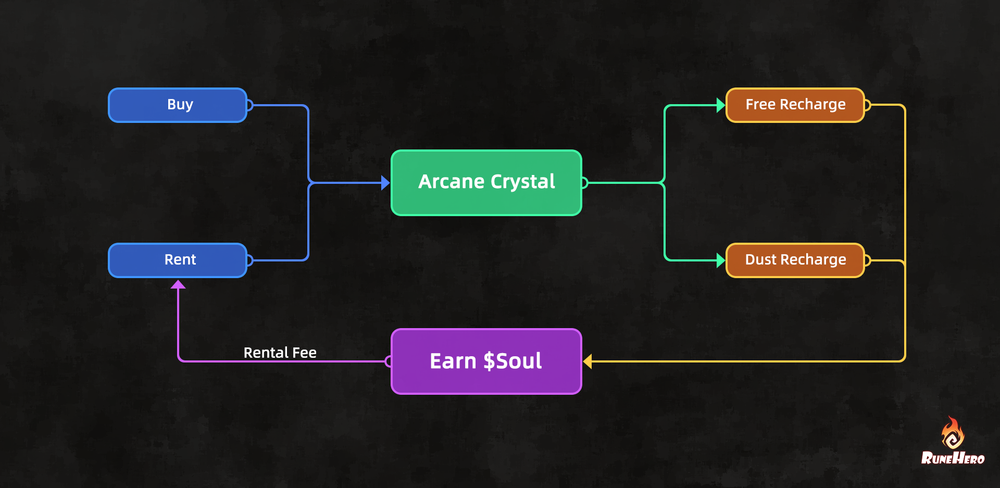

# Arcane Crystal NFT

The **Arcane Crystal** is a utility NFT connected to Rune Hero’s Energy system.

It provides additional Energy, can be upgraded to improve its quality, and may be rented to other players through the in-game marketplace.

<figure><figcaption></figcaption></figure>

### Utility

Players can equip **one Arcane Crystal** at a time.

An equipped Arcane Crystal provides:

* Additional daily Energy recovery;
* The ability to gain more Energy by charging it with Arcane Dust.

Each equipped Crystal can be charged once per day.

### Quality and Upgrading

Arcane Crystals can be upgraded to improve their quality.

Higher-quality Crystals provide:

* More Energy through daily recovery;
* More Energy when charged with Arcane Dust.

Upgrade requirements and Energy values follow the current game version and may be adjusted as the Energy system is balanced.

### Rental

Arcane Crystal owners can list unused Crystals for rent through the in-game marketplace.

A renter can temporarily equip the rented Crystal and use its Energy utility. The owner receives the agreed rental fee.

Rental prices and demand may vary according to Crystal quality, market supply, and player activity.

### Economic Role

Arcane Crystals give active players an optional way to increase their available Energy.

Because only one Crystal can be equipped at a time, players must choose between using a Crystal, upgrading it, or listing unused Crystals for rent.

The Crystal system also helps regulate the rate at which reward-generating activities produce equipment and resources.

### Collection Details

* **Total Supply:** 3,600
* **Official Reserve:** 600
* **Original Mint Price:** 180 SEI

### Marketplace

* **OpenSea:** [https://opensea.io/collection/runehero-arcanecrystal](https://opensea.io/collection/runehero-arcanecrystal)
