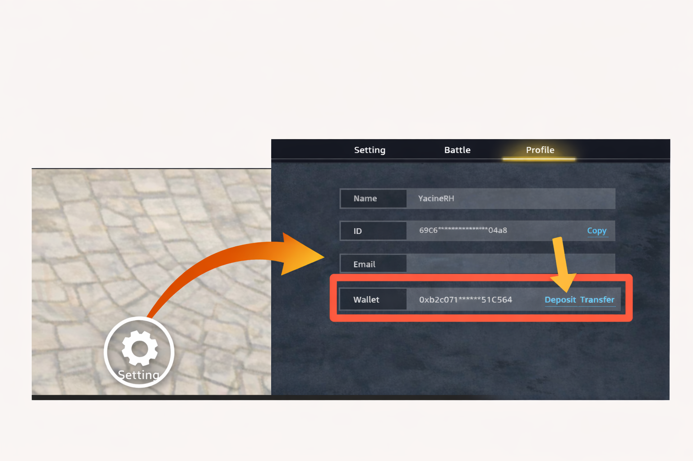
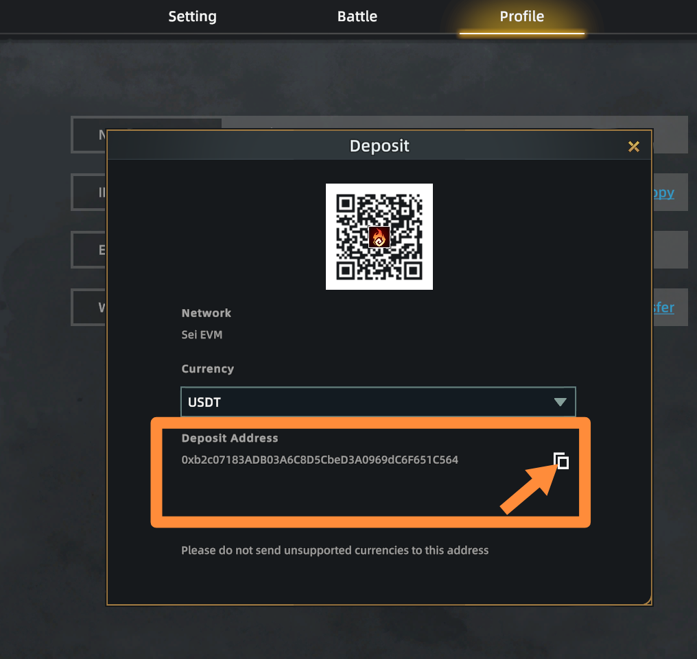
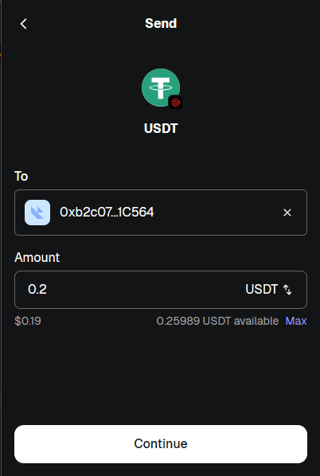
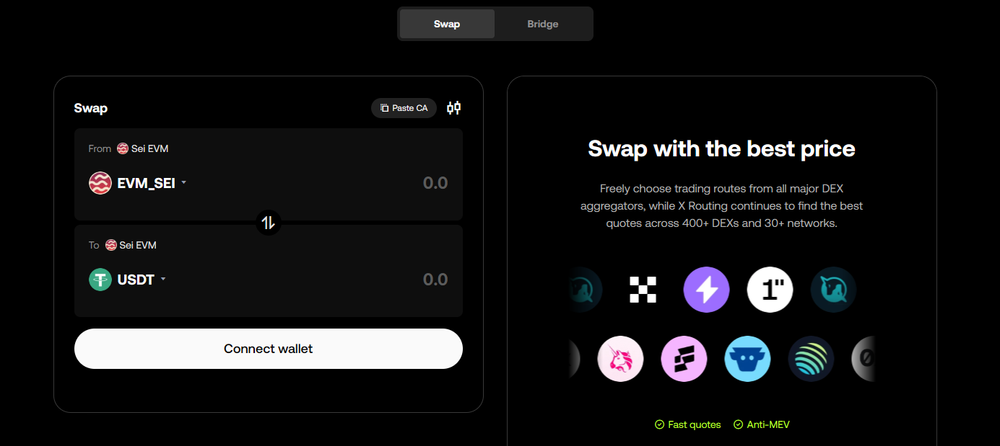
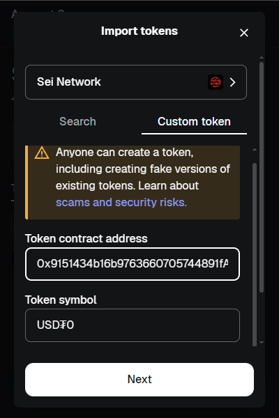
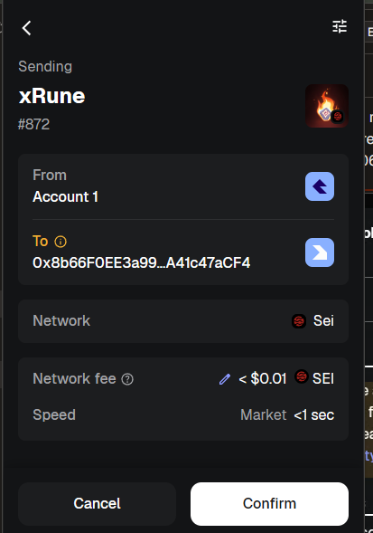
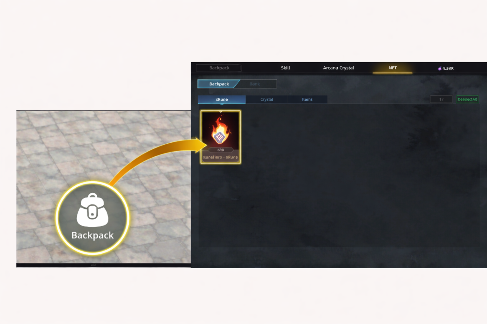

# Deposit and Withdraw

### Get Your In-Game Wallet Address

### Step 1

Go to **Settings → Profile → Deposit**&#x20;

<figure><figcaption></figcaption></figure>

### **Step 2**

Copy your **in-game wallet address**

<figure><figcaption></figcaption></figure>

### How to Deposit USDT

Copy your **in-game wallet address**, send **USDT from your wallet**, then wait for confirmation. Your balance will appear in-game.

<figure><figcaption></figcaption></figure>

### How to Swap SEI to USDT

Use OKX [**Swap**](https://web3.okx.com/dex-swap?chain=sei-evm,sei-evm\&token=0xeeeeeeeeeeeeeeeeeeeeeeeeeeeeeeeeeeeeeeee,0x9151434b16b9763660705744891fa906f660ecc5), connect your wallet, swap **SEI to USDT**, then confirm the transaction.

<figure><figcaption></figcaption></figure>

If **USDT is not visible** in your wallet, you may need to **import it manually on the SEI network** using the contract address below:\
0x9151434b16b9763660705744891fA906F660EcC5

<figure><figcaption></figcaption></figure>

### How to Deposit NFTs

Copy your **in-game wallet address**, send your **NFT from your wallet**, then wait for confirmation. Your NFT will appear in-game

<figure><figcaption></figcaption></figure>

### How to Stake & Unstake NFTs

Go to **Backpack→ NFT** to stake your NFT \
To unstake, select your staked NFT and confirm. \
**Unstaking is only available after the season ends.**

<figure><figcaption></figcaption></figure>

