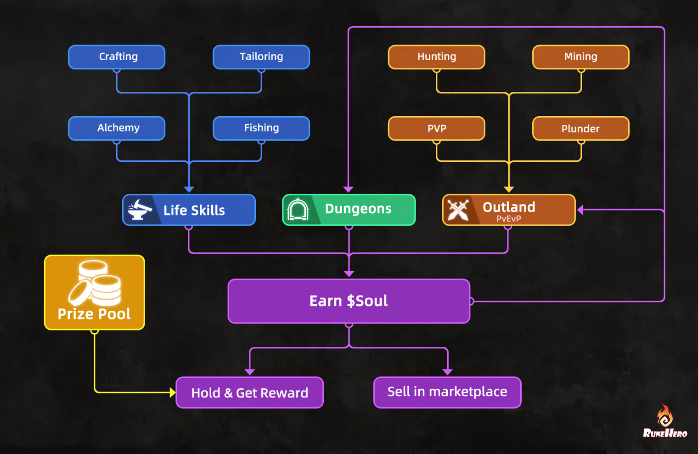

# Season 0



### What is Season 0?

Season 0 is a limited-time pre-test season where players can:

* Experience Rune Hero’s full gameplay loop
* Compete in a complete seasonal system
* Earn rewards and advantages for CBT2

***

### Why Participate?

Season 0 is not just a test — it is your **starting point for CBT2**.

By participating, you can:

* **Secure a head start** in CBT2
* **Earn rewards** from the Season 0 reward pool
* **Get your CBT2 Battle Pass for free**
* Accumulate advantages that carry into the next phase

> Players who do not participate in Season 0 will start CBT2 without these advantages.

***

### How to Participate

<figure><figcaption></figcaption></figure>

#### Step 1 — Enter the Game

All players can join Season 0 and start playing immediately.

#### Step 2 — Play & Earn Soul Shards

Soul Shards are earned through gameplay and are used to participate in the season system.

#### Step 3 — Convert to Season Gems

You can convert Soul Shards into **Season Gems**.

> Season Gems determine your share of the final reward pool.
>
> The more **Season Gems** you hold, the larger your share of the reward pool.

#### Step 4 — Join the Competition

At the end of the season:

> Rewards are distributed based on your share of total Season Gems.

***

### Rewards

#### 1. Season Treasure

<figure><figcaption></figcaption></figure>

Convert Soul Shard to Season Gem.

At the end of the season:

* **USDT** Rewards are distributed based on your Season Gem share
*   Only Battle Pass players can claim Season Treasure rewards.

#### 2. Crystal NFT

<table><thead><tr><th width="391">Season Treasure Rank</th><th>Reward Per Winne</th></tr></thead><tbody><tr><td>1-50</td><td>2</td></tr><tr><td>51-500</td><td>1</td></tr></tbody></table>

There's a extra crystal nft reward for top Season Treasure Rank players.

Only Battle Pass players can claim Crystal NFT rewards.

#### 3. Lottery Rewards

<figure><figcaption></figcaption></figure>

A lottery is held every **3 days**.

Players can win:

* USDT
* Soul Shards
* Rare materials
* NFTs

> Only Battle Pass players can claim lottery rewards.

#### 4. CBT2 Benefits

Season 0 players may receive the following advantages in CBT2:

* **Battle Pass Carryover**\
  Battle Pass purchased in Season 0 will be automatically activated in CBT2.

***

### Invite System

<figure><figcaption></figcaption></figure>

* Invite friends to join and earn rewards for each successful invite.
* Loop every 5 invites, no upper limit

For example you invite 10 players, then you will get $60 as reward.

***

### First Day Rush

A 24-hour launch event rewarding early progression.

* Top 30 players ranked by **Level → Experience**
* Total rewards: **$1000 (USDT)**

<table><thead><tr><th width="250">Rank</th><th>Reward Per Winner($)</th></tr></thead><tbody><tr><td>1</td><td>200</td></tr><tr><td>2</td><td>150</td></tr><tr><td>3</td><td>100</td></tr><tr><td>4-5</td><td>60</td></tr><tr><td>6-10</td><td>35</td></tr><tr><td>11-20</td><td>15</td></tr><tr><td>21-30</td><td>10</td></tr></tbody></table>

#### Guild Bonus

Partner guilds receive additional **Crystal NFT rewards**, distributed independently to their members based on ranking.

**Join Discord and apply.**

***

### Purcahse

To thank all players who participated in Season 0, we will be adding supplementary rules to the Season 0 purchase rules.

#### Battle Pass

* Battle Pass purchased in Season 0 will carry over to CBT2.

#### Arcane Dust

* Arcane Dust is used to charge Crystals.
* Arcane Dust purchased in Season 0 will be 100% refunded in CBT2.

Example: A player purchased 8000 Arcane Dust in Season 0 and used 3000. Upon entering CBT2, the system will automatically refund all 8000 Arcane Dust.

***

### Test Duration

April 6th-26th 8 a.m HKT

April 6th-26th 12 a.m UTC

### Download



### Summary

Season 0 is your opportunity to:

* Learn the game
* Compete in a real season
* Earn rewards
* Prepare for CBT2

> The earlier you start, the stronger your position will be in CBT2.
