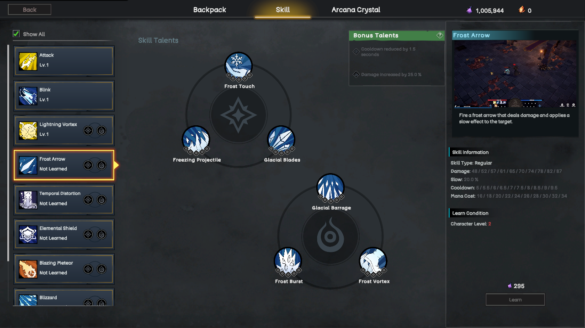

# Characters

Every hero in Rune Hero has a distinctive combat identity, an exclusive skill set, customizable talents, and a powerful Ultimate ability.

Choosing a hero determines how you approach combat, but it does not lock you into a single playstyle. Through skills, talents, equipment, and strategic decisions, the same hero can be developed in different ways for Dungeons, Arena battles, Outland expeditions, or team-based content.

{% embed url="https://files.gitbook.com/v0/b/gitbook-x-prod.appspot.com/o/spaces%2F0cgzQNJpMhVFzJKCx9j7%2Fuploads%2FCRYfChP58W9nBMmUtIY5%2FLobby.mp4?alt=media&token=5c17f179-d0ec-40ed-91f3-a541d6ada466" %}

### Skills and Combat Identity

Each hero has at least **10 unique skills** designed for different combat situations.

Some skills focus on direct damage, while others provide mobility, control, defense, healing, or sustained pressure. Players must select and combine their skills according to their preferred playstyle and the challenges they expect to face.

A build that performs well against dungeon monsters may not be equally effective against another player. Understanding when and how to adjust a skill setup is therefore an important part of mastering a hero.

### Talent System

<figure><figcaption>
UI Skill
</figcaption></figure>

Character progression is not limited to gaining levels. Every skill is connected to a talent system that allows players to change or strengthen how that skill performs.

Each skill includes:

* **3 Enhancement Talents** that improve its existing effects;
* **3 Mutation Talents** that can change how the skill behaves;
* **2 Bonus Talents** that become available after the related Enhancement or Mutation talents reach the required progression level.

Players can activate one Enhancement Talent and one Mutation Talent for each skill.

These choices allow the same skill to serve different purposes. A player may focus on greater damage, stronger control, improved survivability, faster execution, or better support depending on the hero and activity.

As players develop more talents, they gain additional ways to refine their builds instead of following one fixed progression path.

### Ultimate Skills

{% embed url="https://files.gitbook.com/v0/b/gitbook-x-prod.appspot.com/o/spaces%2F0cgzQNJpMhVFzJKCx9j7%2Fuploads%2FRmwRvZSlhNhvmLZUDAQl%2FReks_Ulti.mp4?alt=media&token=c9331058-ef53-49b1-95ce-08d21c7e33a6" %}

Every hero possesses a signature **Ultimate Skill** that represents the peak of their combat identity.

Ultimate Skills can change the direction of a battle, but their effectiveness depends on timing and positioning. Using an Ultimate too early, too late, or against the wrong target may waste one of the player’s strongest opportunities.

For example, Reks can use **Exorcism** to channel his strength into a devastating attack capable of overwhelming nearby enemies. Choosing the right moment to activate it is as important as the power of the ability itself.

### Current Heroes

#### Aelia — Elemental Mage

Aelia is a long-range damage and control hero who commands fire, frost, lightning, and other elemental forces.

Her skills allow players to develop different combat approaches. Aelia can focus on explosive damage, battlefield control, or sustained ranged pressure depending on her talents and equipment.

Her strength lies in controlling distance and creating opportunities before enemies can reach her.

#### Reks — Berserker

Reks is a melee hero built around powerful attacks, close-range pressure, and survivability.

Players can develop him as an aggressive damage dealer capable of overwhelming opponents or choose a more durable build that allows him to remain in combat for longer.

Reks rewards decisive engagement, strong timing, and the ability to manage risk at close range.

#### Morakus — Witch Doctor

Morakus combines toxins, sustained damage, healing, and support abilities.

He can weaken enemies over time, help allies survive difficult encounters, or balance offense and support within the same build. This makes him especially valuable in group activities while still providing meaningful solo options.

Morakus rewards players who understand positioning, resource management, and the changing needs of a battle.

### Building for Different Activities

No single build is ideal for every part of Rune Hero.

* **Dungeons** may reward sustained damage, recovery, and efficient monster clearing;
* **Arena** requires adaptation to enemy heroes, builds, and player behavior;
* **Outland** places additional value on survival, mobility, escape options, and risk management;
* **Team Content** rewards builds that complement the strengths and weaknesses of other heroes.

Players can continue refining their skills, talents, and equipment as they gain a better understanding of each activity.

The goal is not simply to create the strongest hero on paper, but to create the right hero for the challenge ahead.

### Heroes Across Seasons

Rune Hero’s hero roster will continue to expand through seasonal updates.

New heroes can introduce different combat roles, mechanics, skill interactions, and team strategies. Hero availability and access conditions may vary by season, with complete rules published before each new season begins.

One of the utilities of the **Hero Badge** is to unlock access to the paid hero introduced in the following season. Detailed eligibility, activation, transfer, and seasonal rules will be explained on the dedicated Hero Badge page.
