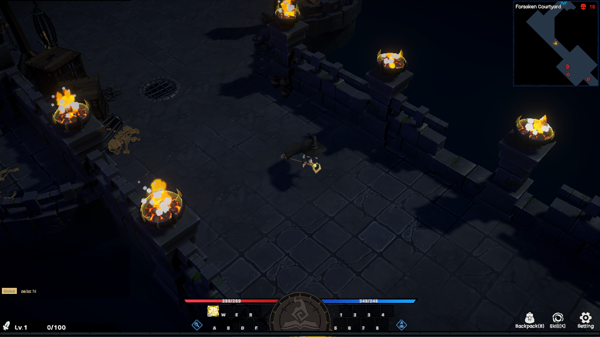

# Dungeon

<figure><figcaption>
Dungeon
</figcaption></figure>

The dungeon system in Rune Hero forms a crucial part of the player’s daily experience, providing core gameplay for character growth, resource acquisition, and self-challenge. Dungeons are primarily designed for single-player mode, tailored for completing daily tasks, leveling up characters, and generating basic equipment and items.

### Core of Growth and Quests

Single-player dungeons are the primary PvE content in Rune Hero, where players can complete daily tasks, level up their characters, and obtain basic item drops and resources. Each dungeon is designed for solo challenges, allowing players to explore the game's world independently without the need for a team, immersing themselves in rich storylines and adventures.

In dungeons, players will face a variety of monsters and environmental challenges, improving their combat skills as they defeat enemies and complete objective-based tasks. Through these encounters, players earn valuable resources such as experience points, equipment, and materials. These fundamental drops provide essential support for character progression, including gear, consumables, and items that enhance the character's abilities.

### Replayability and Strategic Challenges

Rune Hero’s dungeon system places a strong emphasis on replayability. Each time players enter a dungeon, they will encounter a randomly generated layout. These procedurally generated dungeons feature varying designs, monster placements, and challenges, ensuring that every dungeon run feels fresh and avoids the monotony of repetition.

The randomized dungeons not only add excitement to exploration but also require players to adapt to different combat environments and challenges each time. As players progress through the dungeons, they unlock more content and experience unique exploration and combat opportunities, making each dungeon run a distinctive adventure.
