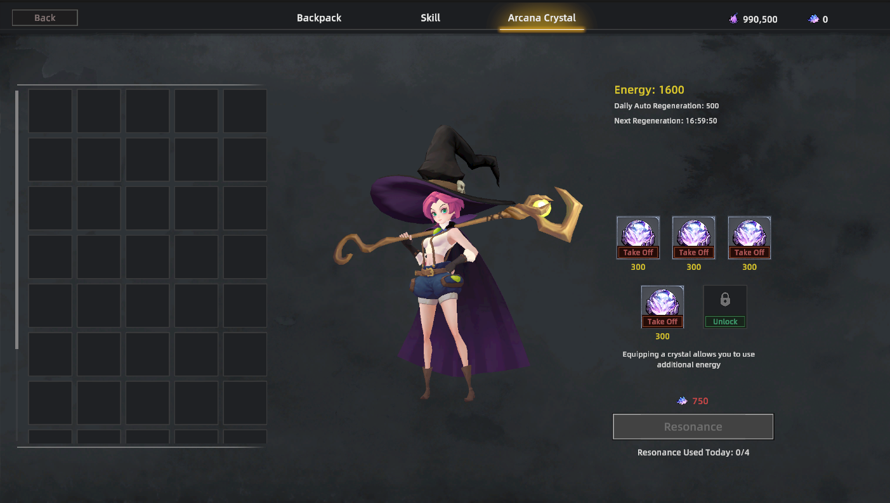

# Energy

<figure><figcaption></figcaption></figure>

**Energy** is a core gameplay resource in Rune Hero.\
All in-game activities that generate rewards require Energy consumption, ensuring that both combat and non-combat progression are tied to strategic resource management.

### **Energy Consumption**

Energy is required for:

* **Life Skill** activities — resource gathering and item production.
* **Dungeon** runs — entering and completing dungeons.
* **Outland** activities — monster hunting, PvP combat, and Aetherite mining.

### **Daily Energy Recovery**

* Every player automatically regenerates **1000 Energy** per day.
*   Players can equip **Arcane Crystals** to increase daily automatic Energy recovery.

    * Each Arcane Crystal provides **+300 Energy/day**.
    * Players can equip up to **5 Arcane Crystals** simultaneously.

### **Arcane Crystal Charging**

In addition to passive recovery, equipped Arcane Crystals can be **charged once per day** using **Dust**:

* Each charging action grants **+700 Energy** for the specific Arcane Crystal.
* Charging multiple Arcane Crystals in a day significantly boosts total available Energy, enabling more gameplay activities and higher potential earnings.

### **Strategic Implications**

Energy management adds depth to Rune Hero’s economy:

* Active players can maximize Energy usage to increase resource output and $Soul earnings.
* Players may choose between passive recovery for steady play or invest in Arcane Crystals and Dust for high-intensity sessions.
* Energy scarcity ensures long-term balance in item supply, maintaining the value of in-game resources.

