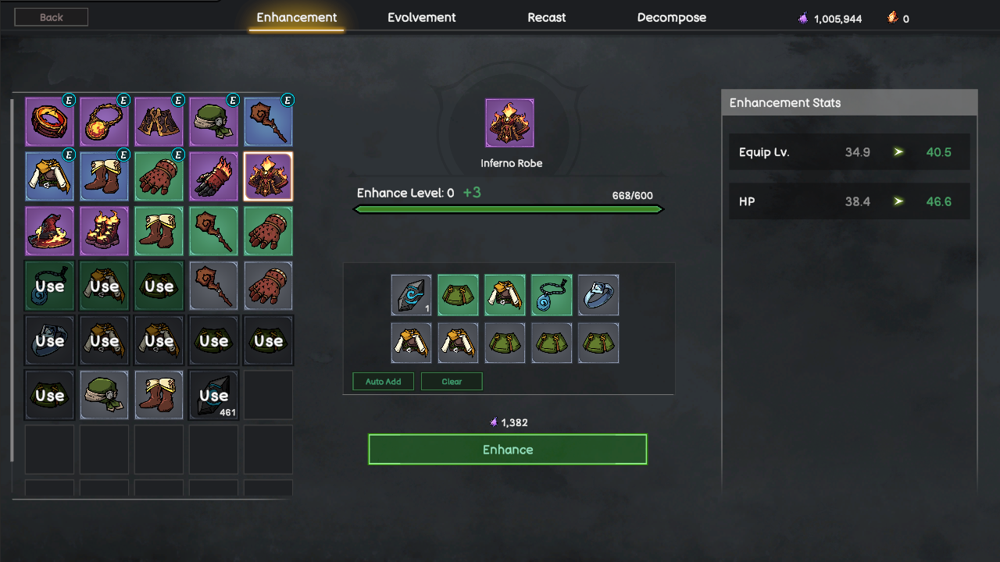
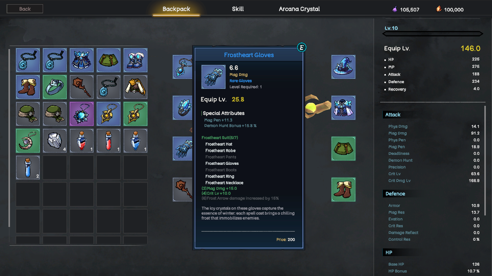
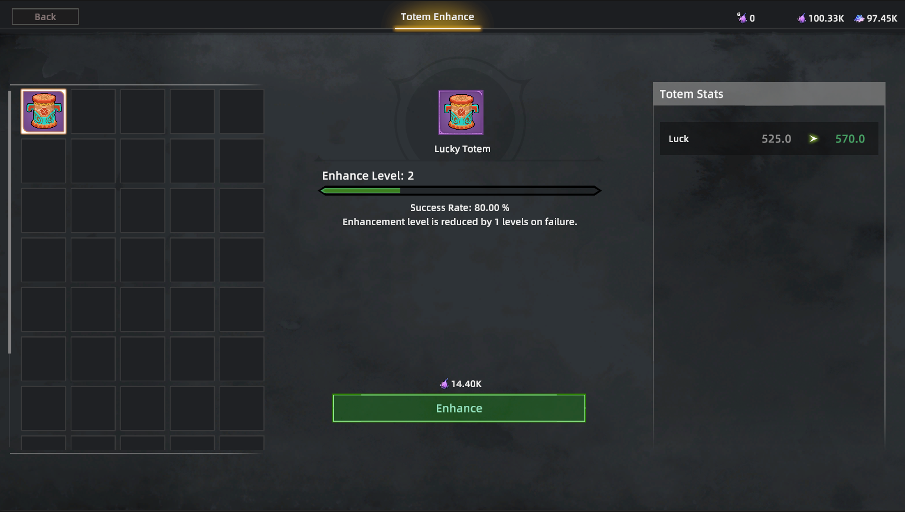

# Equipment

Equipment is one of the main foundations of character development in Rune Hero.

Every piece of equipment can influence a hero’s attributes, combat role, skill performance, and overall build. Players must decide whether an item fits their strategy instead of judging it only by its apparent power.

<figure><figcaption>
UI Equipment
</figcaption></figure>

### Equipment Types and Quality

Equipment is divided into several categories, including:

* Weapons;
* Armor;
* Accessories;
* Special equipment.

Items are available in different quality levels, ranging from common equipment to rare and legendary items.

Higher-quality equipment is more difficult to obtain and may provide stronger attributes, additional effects, or more valuable build opportunities. Legendary equipment can also include distinctive passive effects and appearances.

However, quality is only one part of an item’s value. Its attributes, set bonuses, skill interactions, and compatibility with the player’s build are equally important.

### Randomized Attributes

Equipment can generate randomized attributes when it drops.

These attributes may increase offensive or defensive capabilities, improve survivability, or enhance the effectiveness of particular skills. As a result, two items of the same type and quality may still have different values for different heroes and builds.

Players must compare equipment carefully and decide which attributes best support their intended strategy.

For example:

* A damage-focused build may prioritize offensive attributes and skill enhancements;
* A defensive build may value health, protection, or survivability;
* A PvP build may require different attributes from a dungeon-clearing build;
* A team-focused build may prioritize effects that improve support or sustained performance.

Randomized attributes create an ongoing search for equipment that is not only stronger, but better suited to a specific purpose.

### Enhancement and Progression

<figure><figcaption>
Enhance Equipment
</figcaption></figure>

Players can invest resources to improve valuable equipment.

Enhancement increases an item’s base attributes, allowing useful equipment to remain relevant as the hero progresses. Additional equipment progression can improve an item’s quality and unlock stronger effects.

Because upgrading equipment requires resources, players must decide which items are worth developing. Investing in every item is inefficient, while waiting too long for a perfect item may slow down progression.

Equipment development is therefore both a power system and a resource-management decision.

### Equipment Sets

<figure><figcaption>
Equipment Set
</figcaption></figure>

Some equipment belongs to a set.

Equipping multiple pieces from the same set can activate additional bonuses. These may include:

* Increased base attributes;
* Improvements to specific skills;
* Additional combat effects;
* Unique passive abilities.

More complete sets can unlock stronger bonuses, giving players long-term collection goals and new ways to specialize their heroes.

A complete set is not automatically ideal for every situation. Players may choose between maximizing a set bonus or combining individual items with attributes that better support a particular build.

### Equipment and Character Appearance

Equipment is not only a source of combat power. It can also help players express their character’s identity.

The first version of Rune Hero’s **Skin System** connects selected equipment sets with visible character appearances. When a player equips supported equipment, the hero can display the corresponding look in the game world.

This allows progression and collection to become more visible, especially in social areas where players gather and interact.

The current system is an initial step. In the future, Rune Hero plans to develop a dedicated appearance system that separates cosmetic choices from combat equipment, giving players more freedom to customize how their heroes look without limiting their build choices.

### Lucky Totem

<figure><figcaption></figcaption></figure>

The **Lucky Totem** introduces a new progression path connected to dungeon equipment drops.

Lucky Totems provide a **Luck** attribute. Higher Luck improves the player’s chance of receiving higher-quality equipment from dungeons.

Players can upgrade their Lucky Totem to gain additional Luck, creating a long-term development goal for PvE-focused players.

The Lucky Totem does not replace combat performance. Players must still complete the relevant dungeon content and defeat its enemies. Luck affects equipment opportunities, while successful gameplay remains necessary to earn those opportunities.

Exact Luck values, upgrade requirements, and drop-rate balancing may be adjusted according to the rules of each game version or season.

### Equipment Acquisition

Players can obtain equipment through several activities, including:

* Defeating monsters and dungeon bosses;
* Participating in PvEvP gameplay;
* Exploring higher-difficulty content;
* Collecting materials used to forge special equipment.

Different activities may provide different equipment types, qualities, or materials. This encourages players to participate in multiple parts of the game instead of relying on a single source.

Powerful Legendary Weapons follow a dedicated forging path involving **Celestial Stones**. Their acquisition and forging process are explained on the [Legendary Weapon](https://whitepaper.runehero.io/rune-hero/gameplay/legendary-weapon) page.

### A Long-Term Progression System

Equipment progression is designed to create goals throughout the season.

Players search for better drops, compare randomized attributes, complete equipment sets, improve valuable items, develop Lucky Totems, and adapt their builds for different activities.

The most valuable equipment is not always the item with the highest visible quality. It is the item that helps a player create the right build for the challenge ahead.
