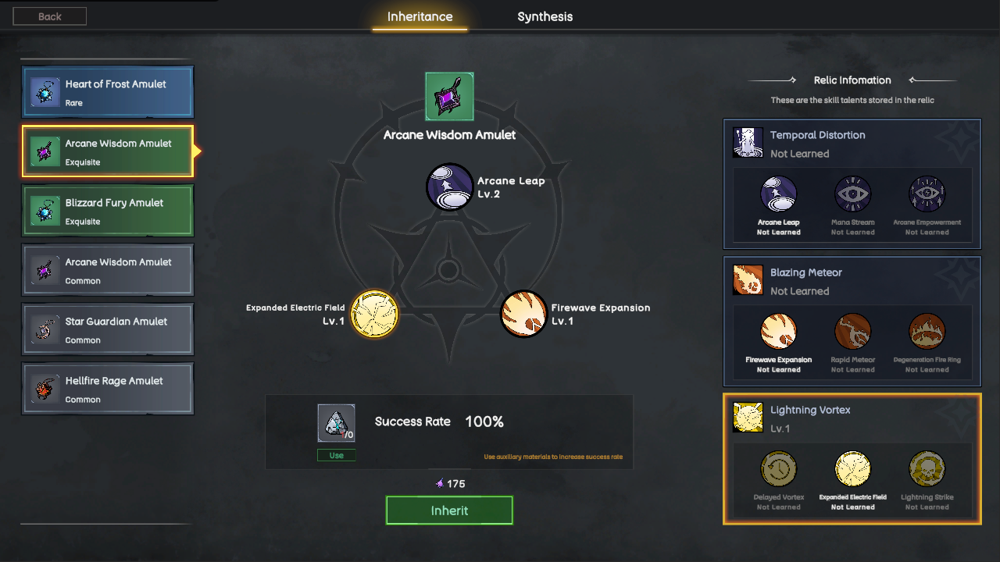

# Item

In Rune Hero, items are essential tools for character development and dungeon exploration, with some items holding significant strategic value.

### Relics

<figure><figcaption>
Relic Inheritance
</figcaption></figure>

Relics play a crucial role in enhancing character talents. Through the legacy system, players can inherit the powerful energy contained within relics to directly upgrade their character's talents.

The acquisition and selection of relics provide a great deal of strategic flexibility for character growth. Players can configure different relics according to their combat style and character role, effectively boosting their combat abilities. This allows for optimization of skill combinations and the creation of unique builds, further diversifying gameplay strategies.
