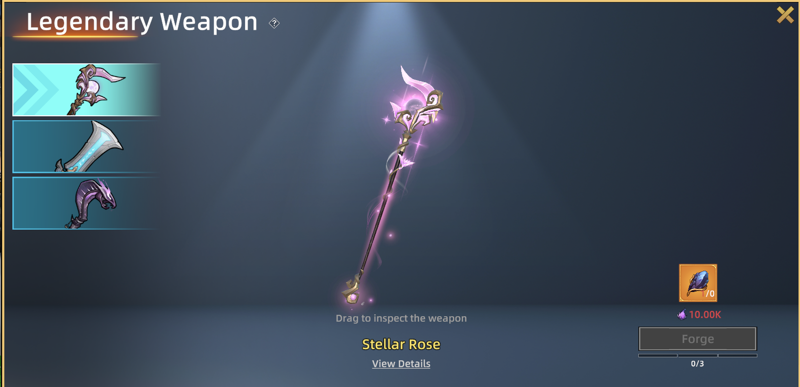

# Legendary Weapon

**Legendary Weapons** are powerful, high-tier weapons that provide a stronger combat experience and unique appearances. Players can obtain them by **forging using Celestial Stones**.

<figure><figcaption></figcaption></figure>

### How to Forge Legendary Weapons

Celestial Stone is a rare material used to forge Legendary Weapons. You can obtain [**Celestial**](https://opensea.io/collection/runehero-gameitems) Stones through in-game activities or the marketplace.

Collect **3 Celestial Stones**, go to the **Legendary Weapon** page, then click **Forge** to create your Legendary Weapon.

### How to Deposit NFTs

Follow the the [step](https://whitepaper.runehero.io/rune-hero/economy/deposit-and-withdraw#how-to-deposit-nfts).

