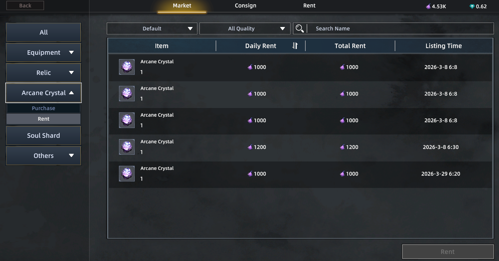

# FAQ

### What is Season 0?

Season 0 is a limited-time pre-test where players can experience the full RuneHero gameplay, compete in seasonal content, and earn rewards for CBT2.

### How do I participate in Season 0?

Join the game, earn Soul Shards by playing, convert them into Season Gems, and compete for rewards at the end of the season

### What is energy&#xD;

Energy is the main resource for all activities in RuneHero. You spend it on **life skills, dungeons, PvP, and other in-game actions**. Learn more [here](https://whitepaper.runehero.io/rune-hero/gameplay/energy).

### How to Increase Energy?

* **Purchase Arcane Crystals (NFTs)** to boost daily Energy: [Buy on OpenSea](https://opensea.io/collection/runehero-arcanecrystal)
* **Rent Arcane Crystals** from the marketplace to gain extra Energy without buying.

<figure><figcaption></figcaption></figure>

💡 You can also **charge Arcane Crystals with Dust** for additional Energy each day.

### Which platforms will the game be released on?

the game will be released on PC to ensure a deep gaming experience

Download Link: [https://runehero.itch.io/runehero](https://runehero.itch.io/runehero)

### Do I need NFTs to earn rewards?

No, NFTs are optional and not required to participate.

### Is there a leaderboard?

Not exactly. Instead of a traditional leaderboard, **Season Treasure rewards are distributed based on the amount of Season Gems you hold** — the more gems, the bigger your reward.

### Do I need Battle Pass?

Battle Pass is required to claim rewards and the battle Pass purchased in Season 0 will be automatically activated in CBT2

### What is the lottery system?

A lottery is held every 3 days where players can win **USDT, Soul Shards, rare materials, or NFTs**. \
Only Battle Pass players can claim lottery rewards

### Is there a friend invite system?

Yes, inviting friends can grant bonus rewards.&#x20;


 

 

